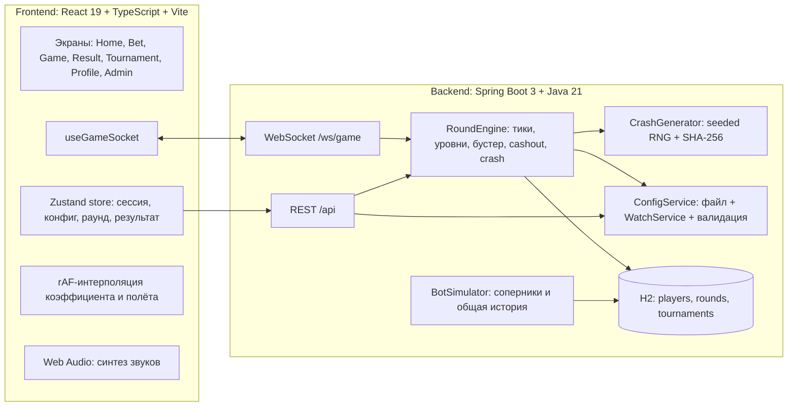
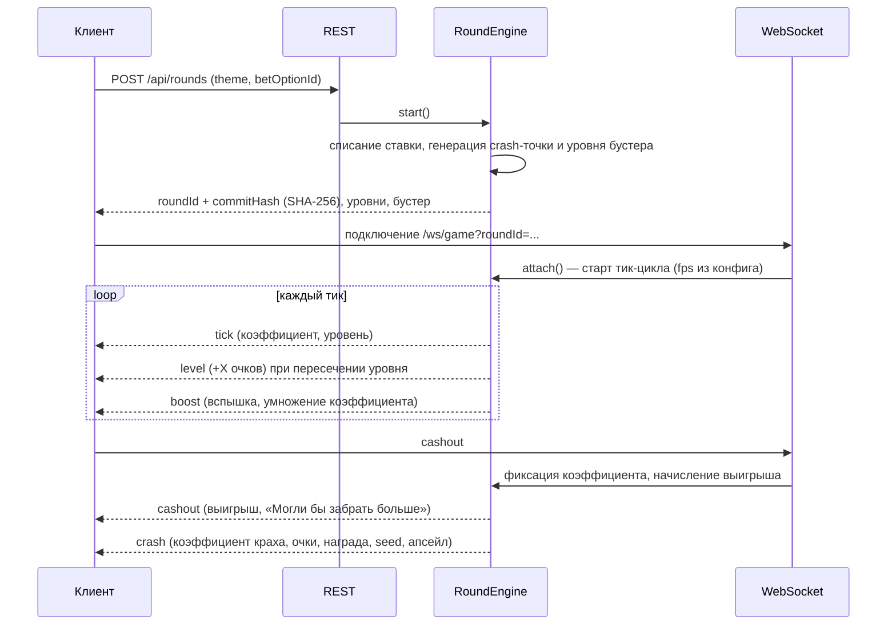
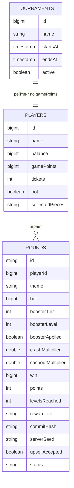

# Архитектура решения

## Общая схема

## Жизненный цикл раунда

Ключевые свойства:

- **Клиент не влияет на исход.** Точка краха и уровень бустера вычисляются в `CrashGenerator` до начала полёта. Клиент получает только SHA-256 от строки `serverSeed:crashMultiplier:lootLine`, а сам секрет — после краха.
- **Коэффициент считает сервер.** `RoundEngine` тикает с частотой `math.fps` (по умолчанию 20 раз в секунду) и рассылает значения в сокет. Клиент интерполирует между тиками по той же формуле роста, чтобы получить 60 fps, но никогда не уходит вперёд более чем на полтора тика и синхронизируется по каждому серверному значению.
- **Cashout авторитетен.** Команда `cashout` в сокете и `POST /api/rounds/{id}/cashout` вызывают один и тот же метод движка: он проверяет, что первый уровень пройден и выигрыш ещё не забран, фиксирует коэффициент и начисляет баллы.
- **Снимок конфигурации на раунд.** `ActiveRound` хранит конфигурацию, действовавшую на момент старта: правки параметров применяются к следующему раунду и не меняют правила в полёте.
- **Очки начисляются сразу.** Каждое пересечение уровня и активация бустера сразу увеличивают игровые очки игрока в базе, поэтому живой рейтинг меняется прямо во время полёта.

## Протокол WebSocket

Канал: `ws://<host>/ws/game?roundId=<uuid>`.

Сервер → клиент (поле `type`):

| Тип | Содержимое |
| --- | --- |
| `state` | полное состояние при подключении: коэффициент, уровень, бустер, очки, fps, growthRate, хеш раунда |
| `tick` | `multiplier` (с учётом бустера), `baseMultiplier`, `level`, `tick` |
| `level` | номер уровня, начисленные очки, суммарные очки раунда |
| `boost` | уровень, значение бустера, новый коэффициент, бонусные очки |
| `cashout` | зафиксированный коэффициент, выигрыш, баланс, сообщение «Могли бы забрать больше» |
| `crash` | коэффициент краха, выигрыш, очки, уровни, награда, `fairness` (хеш + seed), `upsell` (предложение билетов) |
| `error` | текст ошибки на команду клиента |

Клиент → сервер: `{"type":"cashout"}` и `{"type":"ping"}`. Любые другие команды отклоняются.

## REST API

| Метод и путь | Назначение |
| --- | --- |
| `POST /api/session` | демонстрационная сессия: игрок, баланс, очки, билеты, собранные фрагменты, активный раунд |
| `GET /api/players/{id}` | актуальное состояние игрока |
| `GET /api/config/public` | параметры, разрешённые клиенту: темы, уровни, фрагменты ставок, бустеры, очки, апсейл |
| `POST /api/rounds` | старт раунда: списание ставки, выдача `roundId` и `commitHash` |
| `POST /api/rounds/{id}/cashout` | резервный HTTP-путь для cashout |
| `GET /api/rounds/{id}` | состояние раунда для восстановления экрана после перезагрузки |
| `GET /api/history?limit=` | общая история завершённых раундов всех игроков |
| `GET /api/tournament?playerId=&mask=` | участники, очки, место игрока, таймер; `mask=true` скрывает первые 3 символа имён |
| `POST /api/upsell/accept` | покупка билетов: предложение пересчитывается на сервере по данным раунда |
| `GET`/`PUT /api/admin/config` | чтение и запись всех параметров игры, `422` с списком ошибок при недопустимых значениях |
| `GET /api/admin/status` | путь к файлу конфигурации, версия, время последнего применения |

Вероятности расположения бустера (`lootProbabilities`) и параметры распределения краха в публичный
конфиг не попадают — они доступны только через админ-API.

## Модель данных

Турнирный рейтинг не хранится отдельной таблицей: он строится из `players.gamePoints`, поэтому
обновляется мгновенно при начислении очков.

## Клиентская часть

- `src/store/useGameStore.ts` — сессия, публичный конфиг, выбранная тема, активный раунд, результат, тосты, флаги онбординга и апсейла. Тема, звук, маскировка имён и незавершённый раунд сохраняются в `localStorage`, факт показа апсейла — в `sessionStorage` (выход из игры завершает сессию).
- `src/hooks/useGameSocket.ts` — подключение к раунду, разбор событий, до трёх попыток переподключения, если соединение оборвалось до краха.
- `src/hooks/useTournament.ts` — опрос турнира раз в секунду и определение, у кого изменились очки и позиция, для коротких и длинных вспышек.
- `src/screens/GameScreen.tsx` — единственное место, где значение коэффициента пишется прямо в DOM через ref: это позволяет держать 60 fps без перерисовки React-дерева на каждом кадре. Дискретные события (уровень, бустер, cashout) идут через обычное состояние.
- `src/lib/audio.ts` — все звуки синтезируются осцилляторами и шумом, поэтому в репозитории нет аудиофайлов, а браузерное ограничение на автозапуск снимается первым клик��м.

## Производительность и адаптивность

- Анимации используют только `transform`, `opacity` и `bottom` у одного слоя; тяжёлых графических библиотек нет.
- Небо, шары, птицы и облака — инлайн-SVG с CSS-анимациями, за счёт разной случайной длительности движения элементов не синхронизированы.
- Интерфейс рассчитан на диапазон 320–1920 px: на узких экранах используется нижняя навигация из четырёх вкладок, на широких — ссылки в шапке и двухколоночная раскладка экрана ставки.
- `prefers-reduced-motion` отключает анимации для пользователей с соответствующей настройкой системы.
